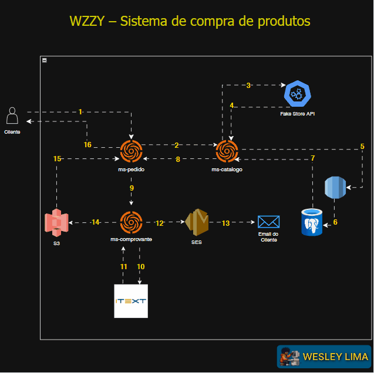

<p align="center">
  
</p>

## PROJETO PESSOAL - MS-COMPROVANTE  📚:

### 📖 Descrição
Microsserviço responsável por **gerar comprovantes de compras realizadas** por clientes. O comprovante é criado em formato **PDF** contendo as informações dos produtos adquiridos e o e-mail do comprador.

Além da geração, o comprovante é:

Este serviço faz parte de uma arquitetura de microsserviços composta por:

- [`ms-catalogo`](https://github.com/seu-usuario/ms-catalogo) – consulta e persistência de produtos via Fake Store API + PostgreSQL (RDS)
- [`ms-pedido`](https://github.com/seu-usuario/ms-pedido) – orquestrador que recebe as solicitações de compra e aciona os demais serviços
- [`ms-comprovante`](https://github.com/seu-usuario/ms-comprovante) – geração de PDF, envio por e-mail e armazenamento S3
- [`bff-ecommerce`](https://github.com/seu-usuario/bff-ecommerce) *(em construção)* – camada intermediária entre frontend e backend, responsável por orquestrar as chamadas.

---
## 🔁 Fluxo de Arquitetura utilizada



1. Cliente → `ms-pedido`: Início da requisição de compra.
2. `ms-pedido` → `ms-catalogo`: Requisição de validação de produtos.
3. `ms-catalogo` → Fake Store API: Consulta externa dos produtos.
4. Fake Store API → `ms-catalogo`: Resposta com detalhes dos produtos.
   5 → 6. `ms-catalogo` → PostgreSQL (via RDS): Persistência dos produtos.
7. PostgreSQL → `ms-catalogo`: Confirmação da persistência.
8. `ms-catalogo` → `ms-pedido`: Retorno dos produtos persistidos.
9. `ms-pedido` → `ms-comprovante`: Geração do comprovante.
   10 → 11. `ms-comprovante` → iText: Geração do PDF.
12. `ms-comprovante` → SES: Envio de e-mail com comprovante.
13. SES → E-mail do cliente: Entrega do e-mail.
14. `ms-comprovante` → S3: Armazenamento do PDF com metadados.
15. S3 → `ms-pedido`: Retorno da URI do comprovante.
16. `ms-pedido` → Cliente: Resposta final ao cliente com link do comprovante.
---

### ⚡ Funcionalidades
1. 🧾 Receber requisição de compra contendo e-mail e lista de produtos;
2. 📄 Gerar comprovante em PDF;
3. 📤 Enviar comprovante por e-mail (AWS SES);
4. ☁️ Armazenar comprovante no S3 com metadados;
5. 🔍 Listar comprovantes disponíveis no bucket;
6. 🔗 Integração com `ms-catalogo` e `ms-notificacao` por WebClient.

#### Métodos de execução:

### 🖥️ **1️⃣ Rodar Localmente**
Para executar o projeto localmente, basta iniciar a aplicação com o Spring Boot:

```sh
./gradlew bootRun
```

> 💡 Este projeto **não utiliza banco de dados** nem possui configuração Docker.

---

## 📌 Endpoints e exemplos de uso:

### 🧾 1 - Gerar Comprovante de Compra:
```cmd
curl --request POST \
  --url http://localhost:8083/v1/comprovantes \
  --header 'Content-Type: application/json' \
  --data '{
  "emailCliente": "cliente@email.com",
  "produtos": [
    {
      "title": "Camiseta Estampada",
      "price": 59.90
    },
    {
      "title": "Calça Jeans",
      "price": 120.00
    }
  ]
}'
```
> ✅ Ao executar essa chamada, um PDF será gerado no diretório `comprovantes/` com os detalhes da compra.

```cmd
curl --request GET \
  --url http://localhost:8083/v1/comprovantes
```
> 🔍 Retorna a lista de URIs dos comprovantes armazenados no S3.
---

#### 🛠️ Tecnologias utilizadas:
- ☕ Java 21;
- 🍃 Spring Boot 3
- 📄 iText para geração de PDF
- 📬 AWS SES (envio de e-mails)
- ☁️ AWS S3 (armazenamento dos comprovantes)
- ⚡ WebClient (integração entre microserviços)
- 🧪 JUnit/Mockito para testes
- 🔧 Gradle

---

### Observação:
- Apenas e-mails verificados no AWS SES (modo sandbox) podem ser utilizados como remetente e destinatário.
- É necessário configurar as credenciais da AWS no application.properties ou através do ~/.aws/credentials.

## 🛺 Autor

<table>
  <tr>
    <td align="center">
      <a href="https://www.linkedin.com/in/wesley-lima-244405251/" title="Wesley Lima">
        <br>
        <sub>
          <b>Wesley Lima</b>
        </sub>
      </a>
    </td>
  </tr>
</table>